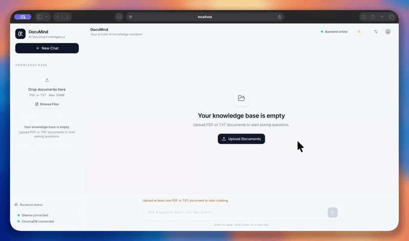

# 📄 DocuMind — AI Document Intelligence

> Ask questions about your own PDF and TXT files and get **grounded answers with page-level source citations** — running **100% locally and privately**. No API keys, no cloud, no data leaving your machine.





---

## ✨ Features

- **Chat with your documents** — upload PDF/TXT files and ask questions in natural language.
- **Source citations you can trust** — every answer lists the exact file and page. Sources are taken from retrieved chunk metadata, so the LLM can never invent filenames or page numbers.
- **Hallucination guard** — answers use only the retrieved context. If nothing relevant is found, DocuMind says so instead of guessing, and shows no sources.
- **Relevance filtering** — weak matches are rejected using a distance threshold and score margin, so noisy chunks never reach the model.
- **Smart indexing** — SHA-256 content hashing and stable chunk IDs prevent duplicate embeddings. Re-uploading identical content is skipped; edited files are re-indexed automatically.
- **Full document management** — upload, list (with ready/pending/stale status) and delete documents; deleting also removes their vectors.
- **Conversation memory** — recent chat turns are passed to the model for natural follow-up questions.
- **Private by design** — LLM and embeddings both run locally through Ollama.
- **Health endpoint** — check Ollama and ChromaDB status at a glance.
- **CLI mode** — `python chatbot.py` still works independently of the web app.

---

## 🏗️ Architecture

```
 React + TypeScript + Tailwind  (Vite, :5173)
              │
              ▼
        FastAPI backend (:8000)
              │
              ▼
   RAG pipeline (LangChain)
   load → chunk → embed → retrieve → filter
              │
              ▼
          ChromaDB  (persistent vector store)
              │
              ▼
   Ollama  ──  nomic-embed-text (embeddings)
           └─  gemma3:4b        (answer generation)
```

### How a question is answered

1. The question is embedded with `nomic-embed-text`.
2. ChromaDB returns the top 8 most similar chunks.
3. Duplicates are removed; if the best match is too weak, the query is rejected as "not found".
4. Up to 4 chunks close to the best score are kept as context.
5. `gemma3:4b` answers strictly from that context, citing chunks as `[1]`, `[2]`.
6. Citations are mapped back to real file/page metadata and shown to the user.

---

## 🧰 Tech Stack

| Layer | Technology |
| --- | --- |
| Frontend | React, TypeScript, Tailwind CSS, Vite |
| Backend | FastAPI, Uvicorn, Pydantic |
| RAG orchestration | LangChain (`langchain-community`, `langchain-chroma`, `langchain-ollama`, text splitters) |
| Vector database | ChromaDB |
| LLM | Gemma 3 (4B) via Ollama |
| Embeddings | `nomic-embed-text` via Ollama |
| Document parsing | PyPDF, LangChain TextLoader |

---

## 🚀 Getting Started

### Prerequisites

- Python 3.11+
- Node.js 18+
- [Ollama](https://ollama.com) installed and running

Pull the required models:

```bash
ollama pull gemma3:4b
ollama pull nomic-embed-text
```

### Installation

```bash
# Clone the repository
git clone https://github.com/Ruddrayadav/DocuMind-Rag-App.git
cd DocuMind-Rag-App

# Backend
python -m venv .venv
source .venv/bin/activate        # Windows: .venv\Scripts\activate
pip install -r requirements.txt

# Frontend
cd frontend
npm install
```

### Run

**Terminal 1 — API**

```bash
source .venv/bin/activate
uvicorn main:app --reload --port 8000
```

**Terminal 2 — UI**

```bash
cd frontend
npm run dev
```

Open **http://localhost:5173** and upload your first document.
Interactive API docs are available at **http://localhost:8000/docs**.

---

## ⚙️ Configuration

Optional environment variables (set in a `.env` file in the project root):

| Variable | Default | Description |
| --- | --- | --- |
| `LLM_MODEL` | `gemma3:4b` | Ollama model used to generate answers |
| `OLLAMA_BASE_URL` | `http://localhost:11434` | Ollama server URL |
| `MAX_UPLOAD_BYTES` | `20971520` (20 MB) | Maximum upload size |
| `CORS_ORIGINS` | `localhost:5173, localhost:3000` | Comma-separated allowed origins |

RAG tuning constants live at the top of `ragpipeline.py`:

| Constant | Value | Purpose |
| --- | --- | --- |
| `CHUNK_SIZE` / `CHUNK_OVERLAP` | 1000 / 200 | Text splitting |
| `RETRIEVAL_K` | 8 | Candidates fetched per query |
| `MAX_BEST_DISTANCE` | 1.02 | Reject query if best match is weaker |
| `SCORE_MARGIN` | 0.045 | Keep only chunks near the best score |
| `MAX_CONTEXT_CHUNKS` | 4 | Chunks sent to the LLM |

---

## 🔌 API Reference

| Method | Endpoint | Description |
| --- | --- | --- |
| `GET` | `/api/health` | Ollama + ChromaDB status |
| `GET` | `/api/documents` | List documents with index status |
| `POST` | `/api/upload` | Upload and index a PDF or TXT file |
| `DELETE` | `/api/documents/{id}` | Delete a document and its vectors |
| `POST` | `/api/chat` | Ask a question, returns answer + sources |

**Example**

```bash
curl -X POST http://localhost:8000/api/chat \
  -H "Content-Type: application/json" \
  -d '{"message": "What is the refund policy?", "history": []}'
```

```json
{
  "answer": "Refunds are available within 30 days of purchase.",
  "sources": [{ "source": "policy.pdf", "page": 3, "file_type": "pdf" }]
}
```

---

## 📁 Project Structure

```
DocuMind-Rag-App/
├── frontend/          # React + TypeScript + Tailwind UI
├── main.py            # FastAPI app (routes, validation, answer generation)
├── ragpipeline.py     # Ingestion, chunking, indexing, retrieval, filtering
├── chatbot.py         # Standalone CLI chatbot
├── requirements.txt
└── README.md
```

---

## 🛣️ Roadmap

- [ ] Support for DOCX, Markdown and web URLs
- [ ] Streaming responses
- [ ] Multi-user workspaces and authentication
- [ ] Docker Compose one-command setup
- [ ] Optional cloud LLM providers (OpenAI / Anthropic) as a drop-in

---

## 🤝 Contributing

Issues and pull requests are welcome. Please open an issue first to discuss major changes.

## 📬 Contact

Built by **Ruddra Yadav** — [GitHub](https://github.com/Ruddrayadav)

Available for freelance RAG / LLM application projects.

## 📝 License

Add a license of your choice (MIT is a common default).
